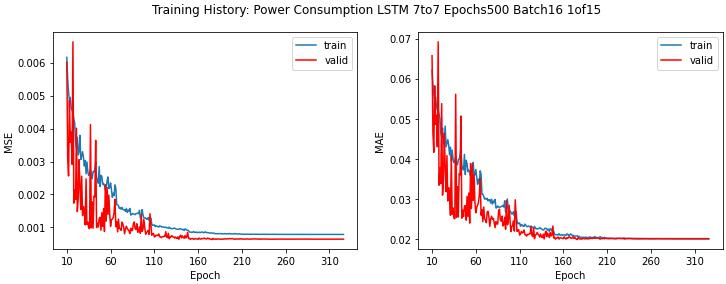

# 台灣工業用電預測 2016 ~ 2019

這是 BDRC 實驗室在 2020 年 3 月至 7 月間進行的專案，作為計畫提案的模擬實驗

我在這個計畫擔任輔助角色，使用學姊 XT 提供的資料，進行模型訓練及優化等工作

## 簡介

這個專案使用台灣 2017 年至 2018 年的工業用電用電資料，預測 2019 年的用電量

在這個專案中，我使用 Keras 搭建 LSTM 模型，以過去 7 天的用電量預測未來 7 天的用電量，最終取得 1.8933 (%) 的 MAPE

## 使用資料

使用 2017/01/01 ~ 2018/12/29 年的資料進行模型訓練，並以 2019/01/06 ~ 2019/09/28 的資料進行驗證，訓練階段每間隔 1 天滾動未來 7 天資料，驗證階段則以 7 天為單位連續預測

實驗使用的資料皆從網際網路取得，包含：台灣電力公司的工業用電資料、政府行政機關辦公日曆表、台灣氣象局的氣象資料等，更多細節請參考[資料描述](./src/data/README.md)章節

## 方法

### 模型

基於工業用電的時間序列特性，我們認為過往的用電量對預測未來的用電量有很大的影響，因此我們使用 LSTM 來預測未來 7 天的用電量，輸入參數為過去 7 天包含歷史用電量在內的參數，模型架構如下：

```python
def get_model(x_shape, y_shape):
    model = tf.keras.models.Sequential()
    model.add(tf.keras.layers.LSTM(units=200, input_shape=(x_shape[1], x_shape[2])))
    model.add(tf.keras.layers.RepeatVector(y_shape[1]))
    model.add(tf.keras.layers.LSTM(units=200, return_sequences=True))
    model.add(tf.keras.layers.TimeDistributed(tf.keras.layers.Dense(200, activation='relu')))
    model.add(tf.keras.layers.TimeDistributed(tf.keras.layers.Dense(1)))
    model.compile(loss='mse', optimizer='adam', metrics=['mae', 'mse'])
    return model
```

由於模型可能會受到隨機性影響，因此會連續訓練 15 個相同的模型，並在驗證階段取每個模型的平均值作為最終預測結果，藉此降低隨機性對預測結果的影響




### 輸入參數

由於工業用電與經濟狀況、氣候狀況等因素有關，例如：天氣熱的時候辦公室會開冷氣、放假的時候工廠會關閉機台，因此我們使用以下資料來預測工業用電：

- 過去 7 天的工業用電量 `power_consumption`
- 過去 7 天的年中日參數 `day_of_year`
- 未來 7 天是否為休假日 `is_holiday_shift7`
- 未來 7 天的星期幾參數 `week_update_shift7`
- 未來 7 天的尖峰負載 `peak_load_shift7`
- 未來 7 天的觀測溫度 `temp_taipei_shift7`

由於尖峰負載與觀測溫是未來 7 天的觀測資料，因此這個實驗是稍微有取巧的，我們曾經有另外訓練模型預測尖峰用電，用以取代觀測值增加實驗的可靠度，若有時間的話會再整理出來

<!-- ### 假日與非假日的電力負載 -->

<!-- ### 尖峰負載 -->

<!-- 在早期實驗裡面，發現模型大多在用電尖峰的預測較差，因此我們將尖峰時段的資料分離出來，並使用不同的模型進行預測 -->


## 結果與結論

最終的預測績效與折線圖如下，可以看到模型在預測 2019 年的工業用電量整體上有不錯的表現，但是在 4 月 ~ 6 月間用電高峰的日子表現較差，那段時間可能還有其他未考慮到的因素影響用電量

RMSE 7.9591 (MkWh)  
MAPE 1.8933 (%)


